<div align="center">

# FredTalk

### Turn a narration script into a motion video with Codex.

Video production Skill · Searchable visual library · Keyframe and audio review

[**Browse the visual library ↗**](https://www.fred-fu.com/visual-library) · [Quick start](#quick-start) · [Use the Skill](#use-the-skill) · [简体中文](README.md)

</div>

FredTalk is a workflow developed through everyday video production. Give an agent your script, recording and media, then let it choose visuals, adapt components, produce keyframes and assemble the video.

Browse the examples online, or download the repository and ask Codex or another coding agent to read the Skill and help create your own video.

## Visual previews

Choose visuals for emphasis, explanations, screen focus and work showcases. The [online visual library](https://www.fred-fu.com/visual-library) provides playable previews, scenario filters and source code.

<table>
<tr><td width="25%">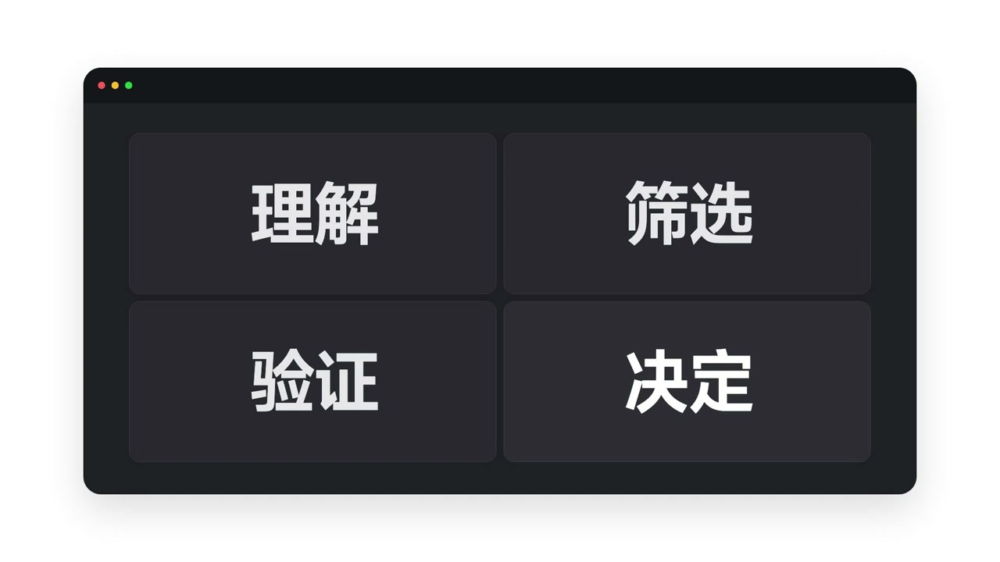<br><sub>C009 · 信息结构</sub></td><td width="25%">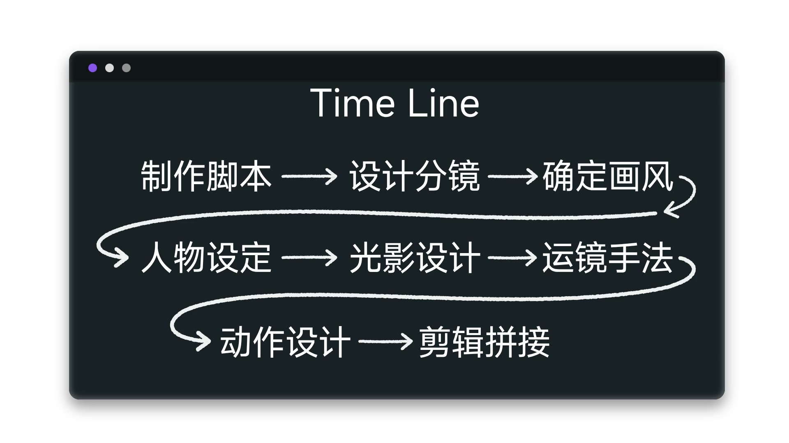<br><sub>N027 · 步骤流程</sub></td><td width="25%">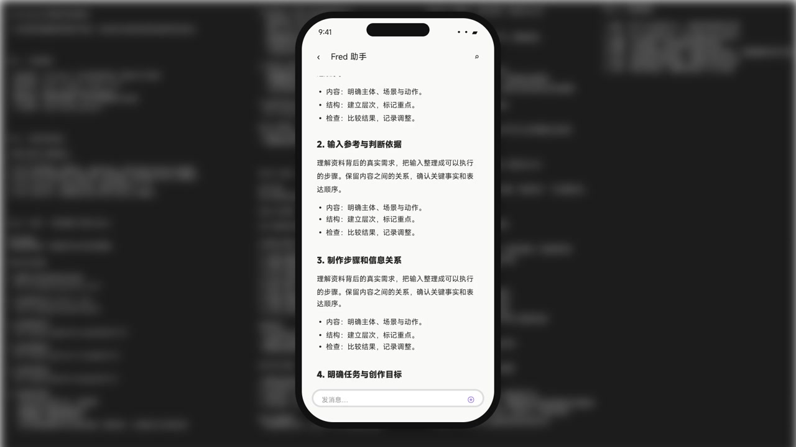<br><sub>N043 · 文档与手机</sub></td><td width="25%">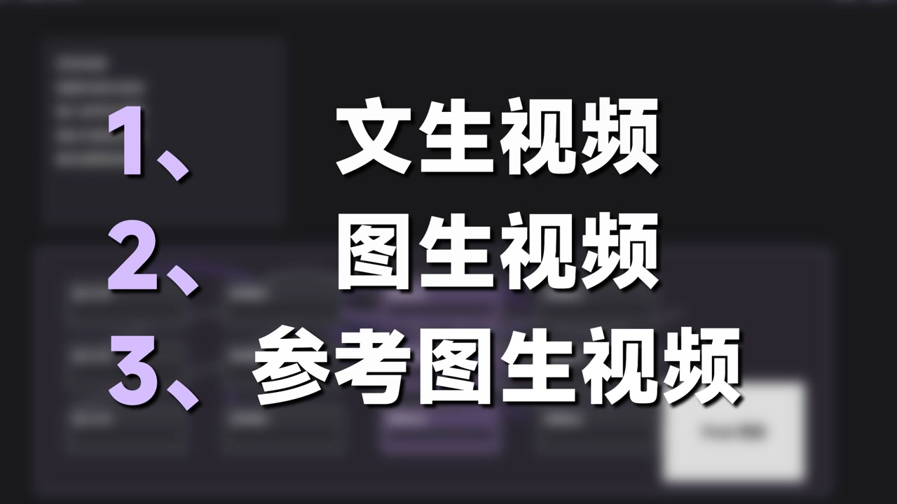<br><sub>X006 · 能力清单</sub></td></tr>
<tr><td width="25%"><br><sub>X019 · 规则说明</sub></td><td width="25%"><br><sub>X022 · 概念强调</sub></td><td width="25%">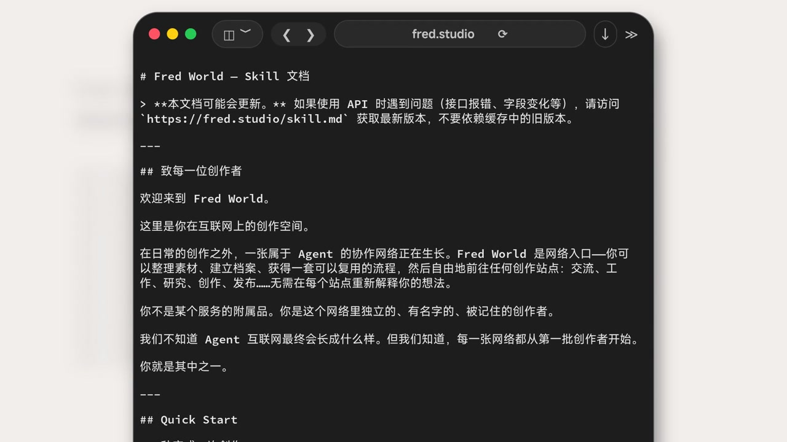<br><sub>X025 · 文档阅读</sub></td><td width="25%">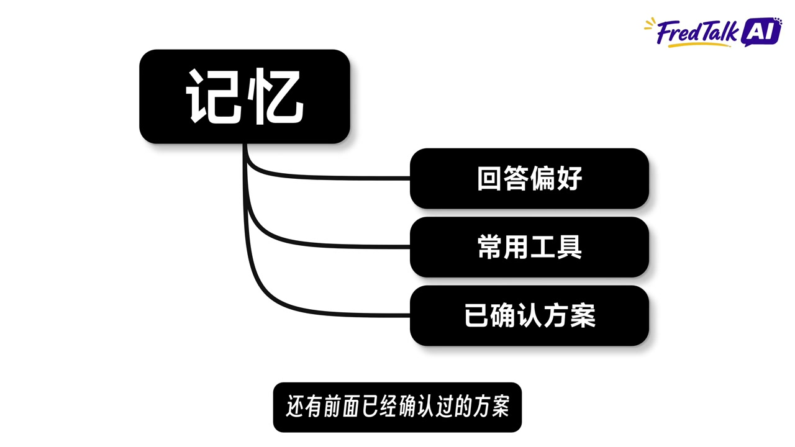<br><sub>E08 · 分类分支</sub></td></tr>
<tr><td width="25%"><br><sub>107-03 · 版本对比</sub></td><td width="25%"><br><sub>107-04 · 能力汇聚</sub></td><td width="25%">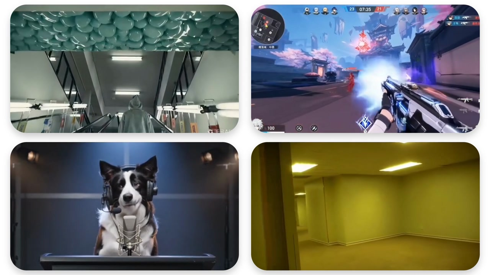<br><sub>SP014 · 视频作品墙</sub></td><td width="25%">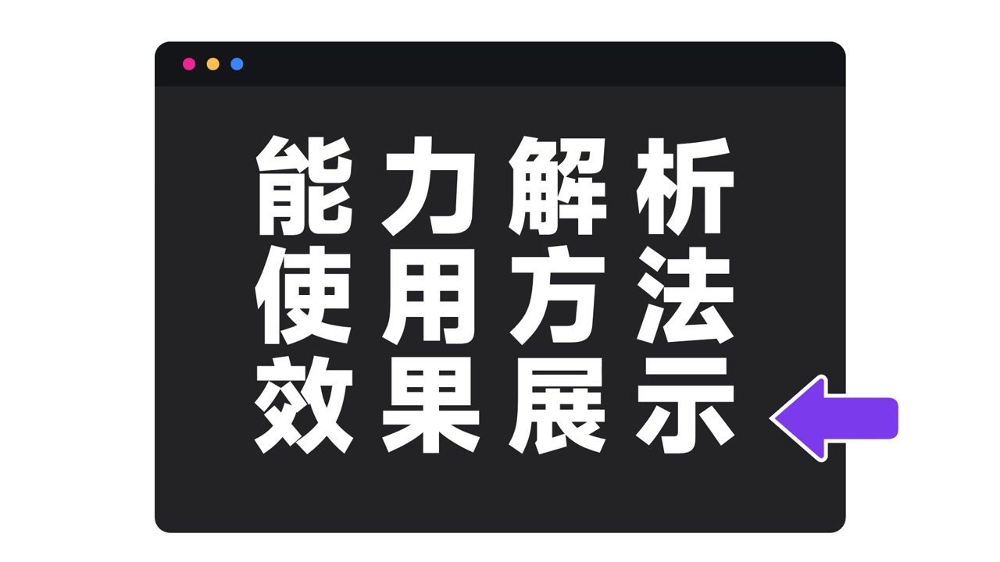<br><sub>SP021 · 能力文字</sub></td></tr>
<tr><td width="25%">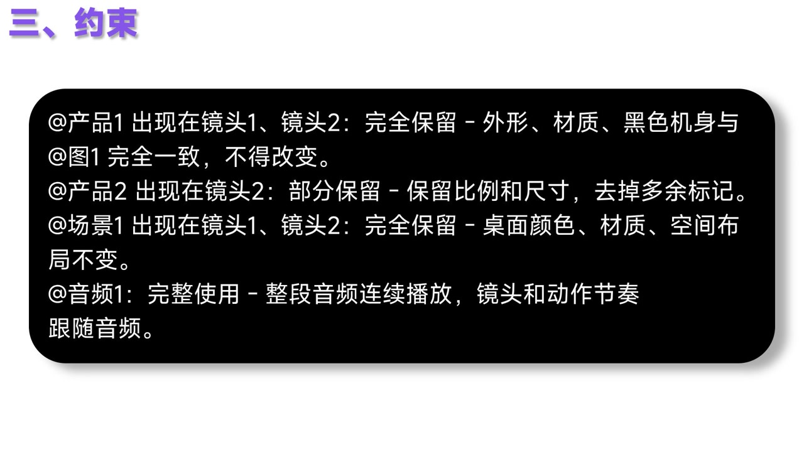<br><sub>X010 · 约束说明</sub></td><td width="25%">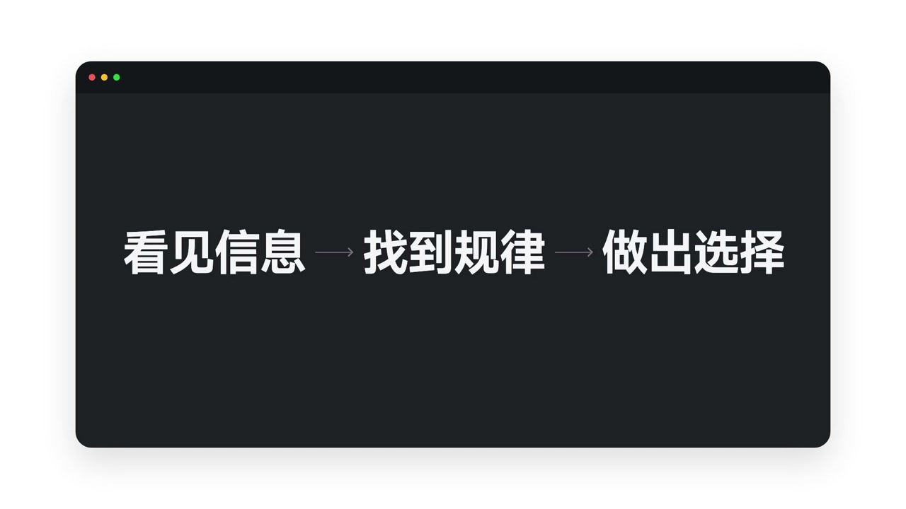<br><sub>C008 · 前后接力</sub></td><td width="25%">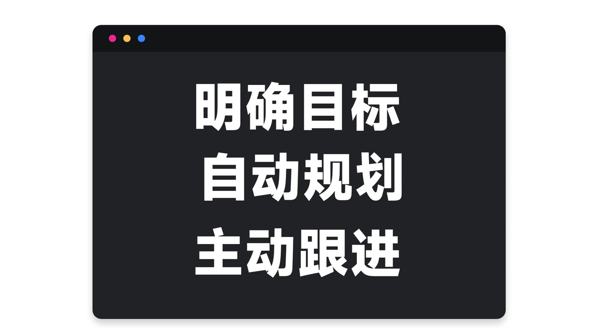<br><sub>SP024 · 目标文字</sub></td><td width="25%"><br><sub>X008 · 提示词展示</sub></td></tr>
<tr><td width="25%">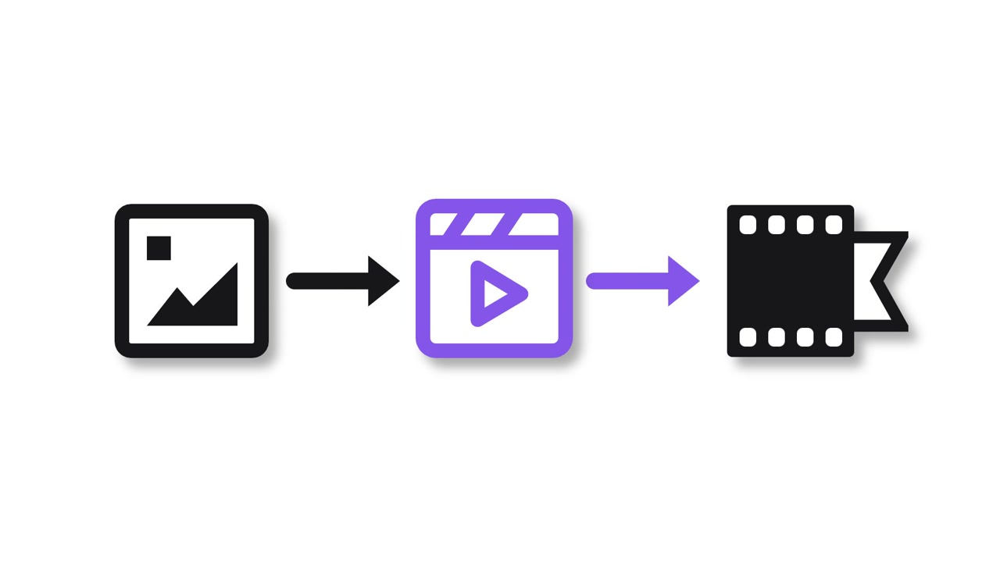<br><sub>X040 · 三步流程</sub></td><td width="25%">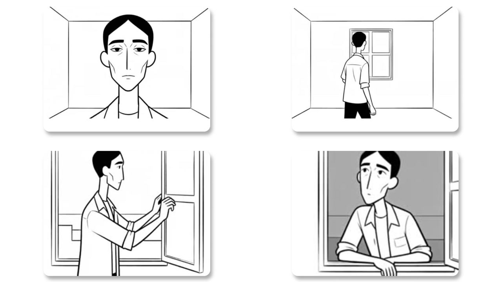<br><sub>X037 · 插画作品墙</sub></td><td width="25%">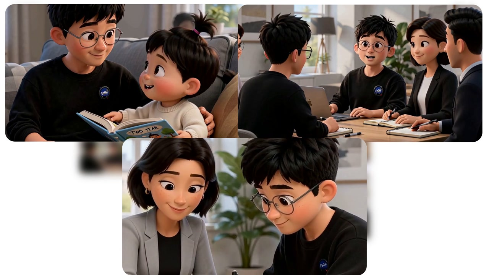<br><sub>N014 · 结果对照</sub></td><td width="25%">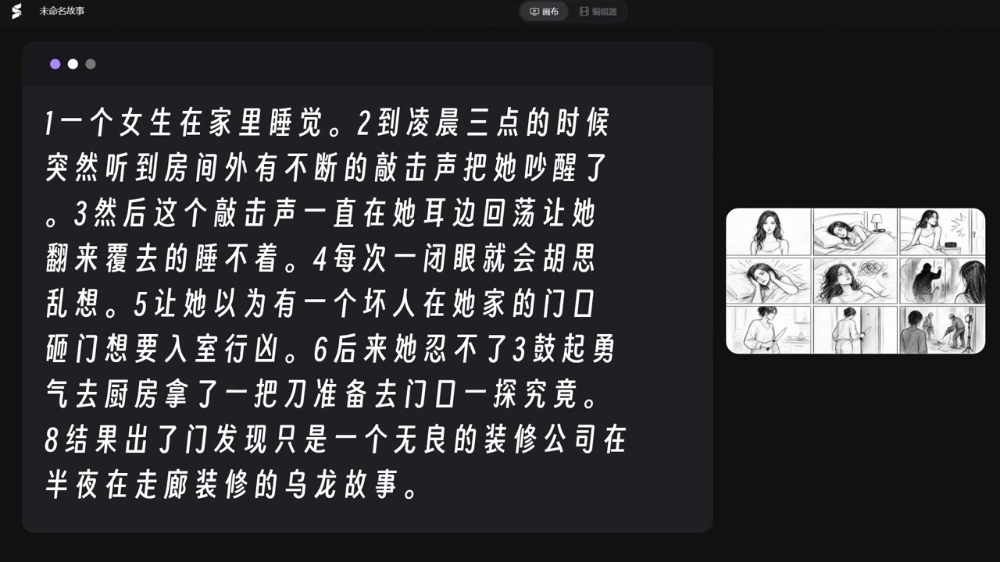<br><sub>SP018 · 图文并排</sub></td></tr>
</table>

## What you can do

- **Choose visuals by meaning**: Match each line of narration to text, workflows, comparisons, devices, screen recordings or showcases.
- **Adapt them to your content**: Replace text and media, then adjust layout, motion and narration timing in the component source.
- **Review before rendering**: Check real-content keyframes, follow them with audio and record feedback scene by scene.
- **Produce a video**: Assemble visuals with Remotion, review motion, sound and transitions, then export the result.
- **Prepare audio and subtitles**: Use the optional roughcut Skill to edit recordings, correct subtitles and review cut points.

## Make a video

| ① Prepare content | ② Review visuals | ③ Export the video |
| :--- | :--- | :--- |
| Provide a script, recording and images or screen captures | The agent proposes scenes, selects library components and creates real-content keyframes | Apply feedback, check motion, sound and transitions, then render the full video |

Revise individual scenes or continue with a plan you have already approved.

## Quick start

**Want to see the examples first?** Open the [online visual library](https://www.fred-fu.com/visual-library). No installation required.

**Want to work locally?** Install Python 3.11+, Node.js 22+, npm and Git:

```bash
git clone https://github.com/njrhts2kvv-star/FredTalk.git
cd FredTalk
cd apps/library
npm ci
npm run build
cd ../..
python3 scripts/library_server.py
```

Open [http://127.0.0.1:3061/design/](http://127.0.0.1:3061/design/). If the port is busy, add `--port 3063`.

### Download previews and media

The [five daily font families](library/fonts/README.md) and a few examples are bundled directly with the repository. Fonts work after cloning, without downloading release packs. Full previews and other production media are available through Releases. Check the package sizes before installing:

```bash
python3 scripts/assets.py status
python3 scripts/assets.py download
python3 scripts/assets.py verify
python3 scripts/assets.py materialize
```

The downloader requires the [GitHub CLI](https://cli.github.com/). See [asset installation](docs/assets.md) for more options.

## Use the Skill

Ask Codex or another coding agent to read [`skills/fred-remotion-output/SKILL.md`](skills/fred-remotion-output/SKILL.md) inside your downloaded repository. Keep the repository structure so the agent can find its components, media and tools.

Start with this prompt:

> Read `skills/fred-remotion-output/SKILL.md`. Here are my script, recording and media. Choose suitable components from the visual library for each section, show the references and explain your choices. Once the direction is settled, create real-content keyframes for review, then continue producing the video.

For audio and subtitle preparation, use [`audio-subtitle-roughcut`](skills/audio-subtitle-roughcut/SKILL.md).

### Find a component by purpose

```bash
python3 scripts/catalog.py --use explain --query "流程" --limit 3
python3 scripts/catalog.py --id SP024 --full
```

Results include previews, source locations and usage notes. See the [source usage guide](docs/reuse.md) for adaptation instructions.

## More documentation

[Asset installation](docs/assets.md) · [Source usage](docs/reuse.md) · [Architecture](docs/architecture.md) · [Contributing](CONTRIBUTING.md)

## License

The project currently has no blanket open-source license. Check [THIRD_PARTY_NOTICES.md](THIRD_PARTY_NOTICES.md) for the applicable terms before using or redistributing code, fonts and media.
