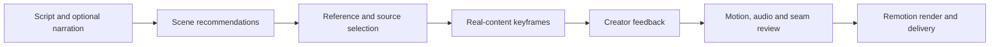

<div align="center">

# FredTalk

### From a script to a clear visual story.

An agent skill, a searchable motion library, and a review workflow for narration-led Remotion videos.

[English](README.md) · [简体中文](README.zh-CN.md) · [Quick start](#quick-start) · [Architecture](docs/architecture.md) · [Privacy review](docs/privacy.md)


</div>

FredTalk connects the decisions that usually get lost between writing a script and rendering a video: **what the audience needs to understand, which motion helps explain it, how the real content fits, and what must be checked before delivery.**

It includes the complete active `fred-remotion-output` Skill instructions, a browser-based reference library, source snapshots and an optional media distribution. “Complete” refers to the active Skill instructions and rules; old scene reproduction and cloud execution still need the relevant assets, environment and configuration. It is currently a **private review repository**, prepared for a later open-source release.

<table><tr><td></td><td></td></tr></table>

## See the system



The library starts with **177 active references**, **16 non-empty usage scenarios**, **288 historical identities**, and **72 source project snapshots**. These counts describe this export, not a promise that every snapshot is a fully parameterized component.

## What you can do

| Capability | What it gives you |
|---|---|
| Choose a visual by purpose | Browse emphasis, lists, workflows, branches, screen focus, comparisons, device scenes and transitions. |
| Inspect the actual reference | Reviewed cover frames, silent video previews, declared time ranges and source links. |
| Give an agent the production context | Scene-level inputs, design decisions, actual call sites, adjacent scenes and preservation constraints. |
| Review with real content | Keyframes use your text and media before internal motion and continuity checks. |
| Keep implementation boundaries honest | Distinguish parameterized components, partial adapters and exact scene snapshots. |
| Work locally | No API key or cloud account is needed to search the catalog or run the visual library. |

## Quick start

Requires Python 3.11+, Node.js 22+ and npm. The commands below require the [GitHub CLI](https://cli.github.com/), signed in with an account that has access to this private repository (`gh auth login`).

```bash
gh repo clone njrhts2kvv-star/FredTalk
cd FredTalk
npm --prefix apps/library ci
npm --prefix apps/library run build
python3 scripts/library_server.py
```

Open **http://127.0.0.1:3061/design/**. If that port is in use, run `python3 scripts/library_server.py --port 3063`.

A small set of silent examples is included in Git. The full catalog and source text remain searchable without downloading the media pack. Missing videos are marked as optional downloads; they do not point to the author's computer.

```bash
# Inspect the size and availability of optional packages.
python3 scripts/assets.py status

# Download the reviewed media packs from this private repository's release.
python3 scripts/assets.py download

# Verify content hashes and materialize source-project assets when needed.
python3 scripts/assets.py verify
python3 scripts/assets.py materialize
```

Browsing, search and source reading do not need the full pack; reproducing a scene does require its declared assets. The download is optional. Assets are content-addressed, checksum-verified and stored under `.artifacts/`; they are not checked into Git. Materializing the complete project tree can use more disk space than the deduplicated download. See [asset distribution](docs/assets.md).

## Find a component

```bash
python3 scripts/catalog.py --list
python3 scripts/catalog.py --use explain --query "流程" --limit 3
python3 scripts/catalog.py --id SP024 --full

# The Skill's familiar reference entry also uses the portable catalog.
python3 skills/fred-remotion-output/scripts/references.py --id SP024 --full
```

Results include semantic matching information, exact source files, preview ranges and reuse limitations. Stable IDs connect references to `implementation.projects` and the recorded `compositionId`; multiple references can share one project. An unrecorded composition ID requires checking that project’s registration entry. Copy the chosen scene before adapting it. Use that project's own `package.json` and lockfile; the library contains several pinned Remotion versions.

## Use the Skill

Start with [`skills/fred-remotion-output/SKILL.md`](skills/fred-remotion-output/SKILL.md). Ask your coding agent to read this file while working inside the clone. This is the supported portable setup: the Skill references the repository's catalog, projects and scripts, so copying only `SKILL.md` is insufficient.

> Read `skills/fred-remotion-output/SKILL.md`. For this script, propose a scene-by-scene visual route using the catalog. Show the matching references and explain their purpose. Then implement real-content keyframes for review before rendering.

The workflow is **script → visual recommendations → direction selection → real component keyframes → feedback → internal motion review → final output**. Existing approvals and explicitly requested direct output take precedence; technical checks do not stand in for visual acceptance.

The portable distribution supports catalog search, scene guidance, workflow validation and the local visual library. Cloud-provider adapters, private episode folders and historical production receipts are not portable credentials or ready-made render jobs. See [reuse and production](docs/reuse.md) before trying to reproduce an old scene.

## Repository map

```text
apps/library/                  React visual library and design guidelines
components/projects/           Sanitized source-project snapshots
library/catalog.json           Active reference database
library/history.json           Historical identities and visibility decisions
library/media-manifest.json    Optional binary paths, hashes and review status
library/demo/                  Small bundled silent examples
skills/fred-remotion-output/   Complete active Skill, references and templates
scripts/                       Local server, catalog search and asset installer
docs/                          Architecture, reuse, privacy and release notes
tests/                         Portable distribution checks
```

## Privacy and release status

This repository is **private by design**. This export applies privacy rules to account information, credentials and local paths, and excludes raw recordings and nested Git histories. The report defines the checked scope and remaining boundaries. FredTalk branding and illustrative characters are retained by the owner's choice.

Media privacy and code scanning are separate checks. Read the [privacy report](docs/privacy.md) for the actual scan coverage, excluded files and remaining review boundaries. A private repository does **not** make an independently hosted website private.

No public media website is deployed by this export. Do not change visibility until the [public-release checklist](docs/public-release.md) is complete.

## Development

```bash
python3 -m unittest discover -s tests
npm --prefix apps/library run build
```

Local review notes are written to `.local/`, which is ignored by Git. The server binds to loopback and exposes only catalog-declared resources.

Contributions should preserve source attribution, identify the exact scene and version, and include meaningful validation. See [CONTRIBUTING.md](CONTRIBUTING.md).

## Licensing and attribution

No blanket open-source license has been granted yet. Source projects, fonts, reference media and third-party dependencies may have different owners and license terms. Their presence here is not permission to redistribute them publicly. See [THIRD_PARTY_NOTICES.md](THIRD_PARTY_NOTICES.md) and the public-release checklist.
