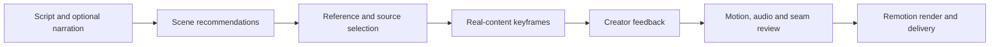

<div align="center">

# FredTalk

### From a script to a clear visual story.

An agent skill, a searchable motion library, and a review workflow for narration-led Remotion videos.

[Browse the visual library](https://www.fred-fu.com/visual-library) · [English](README.md) · [简体中文](README.zh-CN.md) · [Quick start](#quick-start) · [Architecture](docs/architecture.md) · [Privacy review](docs/privacy.md)


</div>

FredTalk connects the decisions that usually get lost between writing a script and rendering a video: **what the audience needs to understand, which motion helps explain it, how the real content fits, and what must be checked before delivery.**

It includes the complete active `fred-remotion-output` Skill instructions, a browser-based reference library, source snapshots and an optional media distribution. “Complete” refers to the active Skill instructions and rules; old scene reproduction and cloud execution still need the relevant assets, environment and configuration. The owner authorized public repository access on 2026-10-04. Source and reviewed media are available publicly; reuse remains subject to the individual license and rights notices.

<table>
<tr><td width="25%"><br><sub>C009 · 多个词组成信息结构</sub></td><td width="25%"><br><sub>N027 · 流程线绕回下一行，连续建立三排步骤</sub></td><td width="25%"><br><sub>N043 · 长文面板横向展开为背景，手机重新到前景</sub></td><td width="25%"><br><sub>X006 · 三种生成方式清单</sub></td></tr>
<tr><td width="25%"><br><sub>X019 · 免费规则窗口</sub></td><td width="25%"><br><sub>X022 · 角色虚化前的三项概念</sub></td><td width="25%"><br><sub>X025 · 文档推近逐行阅读</sub></td><td width="25%"><br><sub>E08 · 记忆分类分支与重新使用</sub></td></tr>
<tr><td width="25%"><br><sub>107-03 · 同尺度版本窗，箭头建立比较</sub></td><td width="25%"><br><sub>107-04 · 三项能力按口播建立，汇聚长胶囊</sub></td><td width="25%"><br><sub>SP014 · 四格视频素材展示</sub></td><td width="25%"><br><sub>SP021 · 深色窗口中的三行能力词</sub></td></tr>
<tr><td width="25%"><br><sub>X010 · 约束示例黑卡</sub></td><td width="25%"><br><sub>C008 · 前一步引出后一步</sub></td><td width="25%"><br><sub>SP024 · 深色窗口两行目标文字</sub></td><td width="25%"><br><sub>X008 · 提示词与能力黑胶囊</sub></td></tr>
<tr><td width="25%"><br><sub>X040 · 图片视频成片三步串联</sub></td><td width="25%"><br><sub>X037 · 插画叠放转四格</sub></td><td width="25%"><br><sub>N014 · 三结果归位溯源，再抽离成三窗对照</sub></td><td width="25%"><br><sub>SP018 · 剧本文字与人物参考图并列</sub></td></tr>
</table>

## See the system



The library starts with **177 catalog references (5 previews quarantined)**, **16 non-empty usage scenarios**, **288 historical identities**, and **72 historical source snapshots and 12 material adaptation projects**. These counts describe this export, not a promise that every snapshot is a fully parameterized component.

## What you can do

| Capability | What it gives you |
|---|---|
| Choose a visual by purpose | Browse emphasis, lists, workflows, branches, screen focus, comparisons, device scenes and transitions. |
| Inspect the actual reference | Reviewed cover frames, silent video previews, declared time ranges and source links. |
| Give an agent the production context | Scene-level inputs, design decisions, actual call sites, adjacent scenes and preservation constraints. |
| Review with real content | Keyframes use your text and media before internal motion and continuity checks. |
| Keep implementation boundaries honest | Distinguish parameterized components, partial adapters and exact scene snapshots. |
| Work locally | No API key or cloud account is needed to search the catalog or run the visual library. |

## Quick start

Requires Python 3.11+, Node.js 22+ and npm. The commands below use the [GitHub CLI](https://cli.github.com/). The repository is publicly accessible; sign in with `gh auth login` if prompted by the optional asset downloader.

```bash
gh repo clone njrhts2kvv-star/FredTalk
cd FredTalk
cd apps/library
npm ci
npm run build
cd ../..
python3 scripts/library_server.py
```

Open **http://127.0.0.1:3061/design/**. If that port is in use, run `python3 scripts/library_server.py --port 3063`.

A small set of silent examples is included in Git. The full catalog and source text remain searchable without downloading the media pack. Uninstalled videos are marked as optional downloads. Five previews are quarantined for privacy review and are not included in the packs; they need safe replacements. No item points to the author's computer.

```bash
# Inspect the size and availability of optional packages.
python3 scripts/assets.py status

# Download the reviewed media packs from the current repository release.
python3 scripts/assets.py download

# Verify content hashes and materialize source-project assets when needed.
python3 scripts/assets.py verify
python3 scripts/assets.py materialize
```

Browsing, search and source reading do not need the full pack; reproducing a scene does require its declared assets. The download is optional. Assets are content-addressed, checksum-verified and stored under `.artifacts/`; they are not checked into Git. Materializing the complete project tree can use more disk space than the deduplicated download. See [asset distribution](docs/assets.md).

## Find a component

```bash
python3 scripts/catalog.py --list
python3 scripts/catalog.py --use explain --query "流程" --limit 3
python3 scripts/catalog.py --id SP024 --full

# The Skill's familiar reference entry also uses the portable catalog.
python3 skills/fred-remotion-output/scripts/references.py --id SP024 --full
```

Results include semantic matching information, exact source files, preview ranges and reuse limitations. Stable IDs connect references to `implementation.projects` and the recorded `compositionId`; multiple references can share one project. An unrecorded composition ID requires checking that project’s registration entry. Copy the chosen scene before adapting it. Use that project's own `package.json` and lockfile; the library contains several pinned Remotion versions.

## Use the Skill

Start with [`skills/fred-remotion-output/SKILL.md`](skills/fred-remotion-output/SKILL.md). Ask your coding agent to read this file while working inside the clone. This is the supported portable setup: the Skill references the repository's catalog, projects and scripts, so copying only `SKILL.md` is insufficient.

> Read `skills/fred-remotion-output/SKILL.md`. For this script, propose a scene-by-scene visual route using the catalog. Show the matching references and explain their purpose. Then implement real-content keyframes for review before rendering.

The workflow is **script → visual recommendations → direction selection → real component keyframes → feedback → internal motion review → final output**. Existing approvals and explicitly requested direct output take precedence; technical checks do not stand in for visual acceptance.

The portable distribution supports catalog search, scene guidance, workflow validation and the local visual library. Cloud-provider adapters, private episode folders and historical production receipts are not portable credentials or ready-made render jobs. See [reuse and production](docs/reuse.md) before trying to reproduce an old scene.

## Repository map

```text
apps/library/                  React visual library and design guidelines
components/projects/           Sanitized source-project snapshots
library/catalog.json           Active reference database
library/history.json           Historical identities and visibility decisions
library/media-manifest.json    Optional binary paths, hashes and review status
library/demo/                  Small bundled silent examples
skills/fred-remotion-output/   Complete active Skill, references and templates
scripts/                       Local server, catalog search and asset installer
docs/                          Architecture, reuse, privacy and release notes
tests/                         Portable distribution checks
```

## Privacy and release status

This repository is **public by the owner’s explicit decision**. This export applies privacy rules to account information, credentials and local paths, and excludes raw recordings and nested Git histories. The report defines the checked scope and remaining boundaries. FredTalk branding and illustrative characters are retained by the owner's choice.

Media privacy and code scanning are separate checks. Read the [privacy report](docs/privacy.md) for the actual scan coverage, excluded files and remaining review boundaries. Repository visibility does not control independently hosted websites or CDN caches.

The current visual library is available at [FredTalk](https://www.fred-fu.com/visual-library). The superseded media release is retained as a private draft backup. See [publication status](docs/public-release.md) for the checked scope and remaining rights boundaries.

## Development

```bash
python3 -m unittest discover -s tests
(cd apps/library && npm run build)
```

Local review notes are written to `.local/`, which is ignored by Git. The server binds to loopback and exposes only catalog-declared resources.

Contributions should preserve source attribution, identify the exact scene and version, and include meaningful validation. See [CONTRIBUTING.md](CONTRIBUTING.md).

## Licensing and attribution

No blanket open-source license has been granted yet. Source projects, fonts, reference media and third-party dependencies may have different owners and license terms. Their presence here is not permission to redistribute them publicly. See [THIRD_PARTY_NOTICES.md](THIRD_PARTY_NOTICES.md) and the public-release checklist.


## 2026-10-04 update / 本次更新

The portable Skill now includes a current-catalog delivery gate, parsed source invocation checks, audio-synchronized discrete keyframe review, and the optional audio/subtitle roughcut Skill. No private narration, credentials or episode feedback is included. Natural-voice preprocessing requires the user's own verified environment. Historical snapshots and third-party assets retain the release limitations in docs/public-release.md.

便携版已更新认可组件/二创约束、真实源码调用检查、关键帧随音频播放和独立音频字幕粗剪。具体范围见对应SKILL.md；旧源快照不因此成为通用参数接口或公开素材授权。
